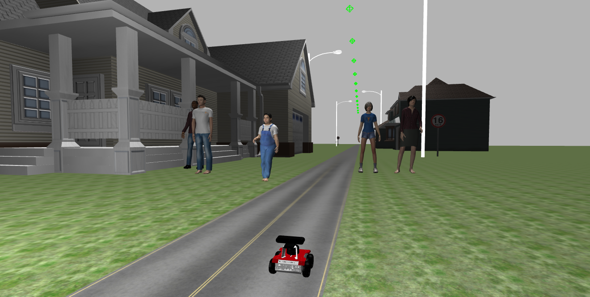

# rosbot-perception

This repository focuses on [rosbot](https://husarion.com/manuals/rosbot/)perception capabilities using ROS. The primary functionalities include object detection, 
AR tag recognition, and image processing using OpenCV. The code is structured to subscribe to the robot's camera feed, process the 
images, and execute various perception tasks.

**Note:** The work was developed and tested on a simulation workspace provided by [Bitbucket: Public Simulations](https://bitbucket.org/theconstructcore/workspace/projects/PS)

 

**Scenario**:
There is a dangerous person in the city, and many possible suspects are close to the robot. The goal is to navigate through the environment, detect all the people and highlight the dangerous one.

**Features:**
- AR Tag Detection: Spawn a wall, detect and visualize AR tags in the camera feed.
- People Detection: Identify and mark people in the camera feed using HOG descriptor.
- Image Feature Matching: Extract and match features from different images using ORB detector.
- Image Documentation: Capture and save images from the camera feed.
[artag](./images/artag.png) [founded](./images/founded.png)

1. Clone the repository:
'''bash
git clone git@github.com:mobinajamali/RobotPerception.git
'''
2. Install dependencies:
'''bash
pip install -r requirements.txt
'''

